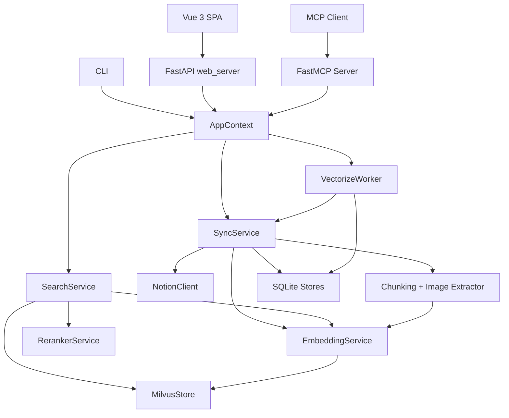
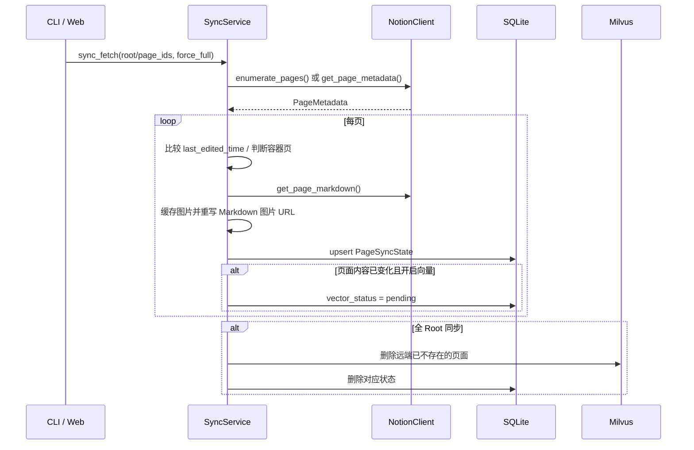
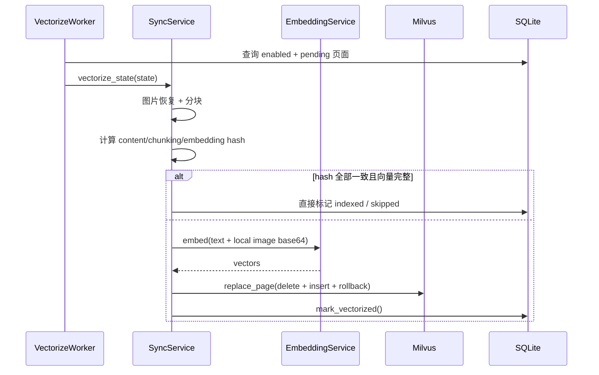
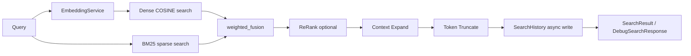

# RAG Notion 知识库系统 — 系统架构

> **版本**：v2.0.0  
> **日期**：2026-08-14  
> **依据**：当前 `src/rag_notion_kb/` 代码实现。  
> **边界**：本文只描述架构与职责，具体模型、Schema、API、CLI 见 `Backend.md`，前端见 `Frontend.md`。

## 1. 系统概览

RAG Notion KB 是一个本地优先的 Notion 知识库检索系统。它把 Notion 页面递归导出为 Markdown，先持久化原始内容与同步状态，再按页面开关异步执行分块、多模态 Embedding 和 Milvus 索引。上层提供三种交互入口：

- **Web UI**：Root 管理、选择性同步、页面检查、检索调试与历史。
- **CLI**：同步、状态、检索、检查、Web 服务、MCP 服务、配置展示。
- **MCP Server**：面向 Agent 的检索、同步、统计与全文读取。

## 2. 设计原则

1. **代码为唯一 Source of Truth**：文档、Schema 和测试都由实现驱动。
2. **同步拆为两阶段**：拉取阶段快速、可重试；向量化阶段昂贵、异步、可独立控制。
3. **原始内容优先持久化**：`raw_markdown` 保留在 SQLite，向量化失败不会丢失已拉取内容。
4. **本地优先**：Milvus Lite、SQLite 与图片缓存都在 `~/.rag_kb`，无外部向量数据库依赖。
5. **失败隔离**：单页失败不阻断批量任务；ReRank 或历史写入失败不阻断检索。
6. **明确生命周期**：`AppContext` 集中创建与关闭所有长连接资源。

## 3. 目录与模块

```text
src/rag_notion_kb/
├── app_context.py
├── cli.py
├── config.py
├── exceptions.py
├── models.py
├── mcp_server.py
├── notion/client.py
├── embedding/{qwen_vl.py,reranker.py}
├── processing/{chunking.py,images.py}
├── retrieval/{context_expand.py,hybrid_search.py,truncate.py}
├── services/{search_service.py,sync_progress.py,sync_service.py,vectorize_worker.py}
├── storage/
│   ├── milvus_store.py
│   ├── root_store.py
│   ├── schema.py
│   ├── search_history_store.py
│   ├── sync_state.py
│   └── tree_cache.py
└── web/{web_server.py,static/}
```

## 4. 分层架构



各层职责：

| 层 | 模块 | 职责 |
|----|------|------|
| 交互 | `web_server.py`, `mcp_server.py`, `cli.py` | HTTP API、MCP stdio、命令行 |
| 编排 | `AppContext` | 依赖注入与资源生命周期 |
| 服务 | `SyncService`, `SearchService`, `VectorizeWorker`, `SyncProgressTracker` | 同步、检索、后台任务与进度 |
| 数据访问 | Notion client、Embedding/Reranker、Milvus、SQLite stores | 外部系统与本地持久化 |
| 处理 | chunking、images、context_expand、hybrid_search、truncate | Markdown/图片处理与检索中间步骤 |

## 5. 同步数据流

### 5.1 拉取阶段 `sync_fetch`



`sync_fetch` 不执行分块、Embedding 或 Milvus 写入。它保存 `raw_markdown`、父级 ID、状态、图片缓存 URL 以及后续用于跳过判断的 hash 字段。

### 5.2 向量化阶段 `sync_vectorize`



Worker 默认 2 秒轮询，并发上限来自 `VectorizeConfig.max_concurrent`。启动时会把异常中断遗留的 `indexing` 页面重置为 `pending`。

## 6. 检索数据流



生产 `SearchService.search()` 返回 `SearchResult`；`debug_search()` 保留每阶段分数和数量，供 Web UI 调参。Dense 与 sparse 权重默认 `0.5/0.5`，在融合前归一化。检索历史写入失败不会使检索失败。

## 7. 状态与数据持久化

运行时数据目录：

```text
~/.rag_kb/
├── config.yaml
├── sync_state.db
├── milvus.db/
├── images/{page_id}/
└── .milvus_addr
```

SQLite 中的表：

| 表 | 用途 |
|----|------|
| `page_sync_state` | 页面原始 Markdown、同步状态、向量开关与 hash |
| `notion_roots` | Root 页面配置 |
| `page_tree_cache` | Root 下的轻量页面树缓存 |
| `sync_progress` | 批量同步任务状态 |
| `search_history` | Debug/MCP/CLI 检索历史 |

Milvus collection 为 `rag_kb_chunks`，包含文本 chunk 与图片 document。BM25 sparse vector 由 `chunk_text` 字段上的 BM25 function 生成。

## 8. 配置优先级

```text
init args > RAG_KB_* 环境变量 > .env > ~/.rag_kb/config.yaml > file secrets
```

嵌套配置使用 `__` 分隔，例如 `RAG_KB_EMBEDDING__API_KEY`。CLI 的 `--root` 参数优先于 SQLite `notion_roots`，SQLite 活跃 Root 优先于 `notion.root_page_ids`。

## 9. 错误处理与韧性

- Notion 幂等读请求使用 tenacity 重试 3 次。
- `EmbeddingError` 表示单批次失败，可降级为零向量并在同步结果中标记；`EmbeddingServiceError` 表示服务不可用，停止整体向量化。
- Milvus 页面替换在插入失败时恢复旧行；进程中断后的 `indexing` 状态由 Worker 启动时重置。
- Web API 对非法 page ID 返回 400，对缺失页面返回 404，对重复 Root 返回 409。
- SQLite 连接开启 WAL、busy timeout 和正常 synchronous 级别。

## 10. 文档治理

活跃文档：

```text
docs/
├── README.md
├── Spec.md
├── Architecture.md
├── Backend.md
├── Frontend.md
├── Stand.md
├── Manual.md
├── consistency-report.md   # 自动生成
├── archived/               # 已实现并验收的计划
├── dev/                    # 当前待实现计划
└── diagrams/
```

运行 `python scripts/consistency_check.py --fail-on-mismatch` 生成一致性报告并校验模型、配置、异常、SQLite Schema、API、CLI、MCP 与前端文件清单。

## 11. 修订历史

| 版本 | 日期 | 变更内容 |
|------|------|----------|
| v2.0.0 | 2026-08-14 | 由原 Plan.md 重组为当前架构说明，纳入两阶段同步、Root/树缓存、异步向量化、检索调试与历史 |
