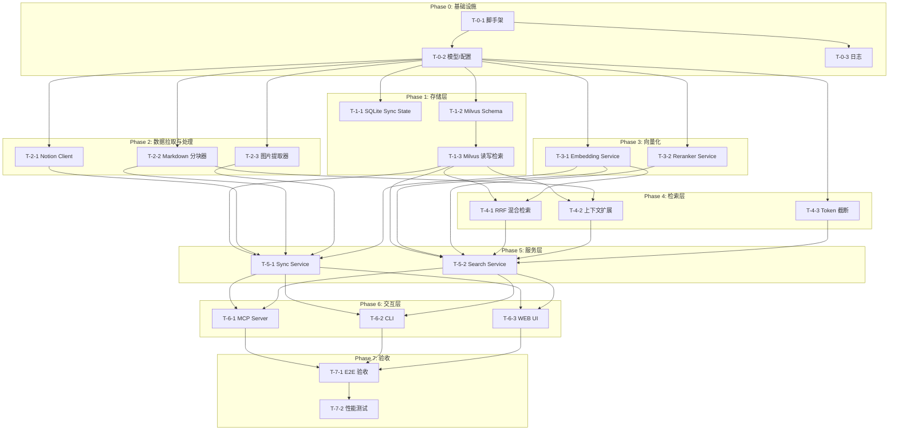
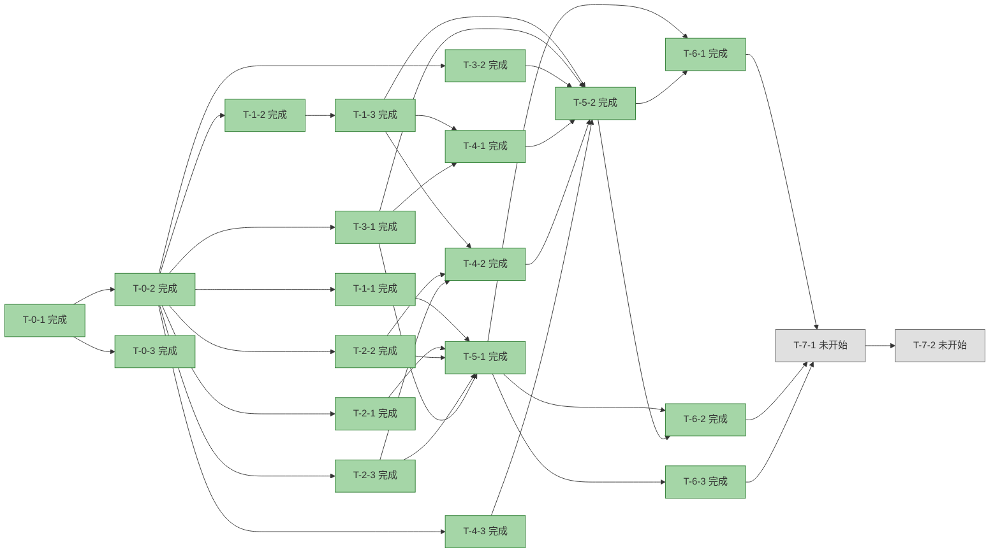

# RAG Notion 知识库系统 — 任务拆分与依赖 DAG

> **版本**：v1.0  
> **日期**：2026-08-10  
> **依据**：Spec.md v1.2 / Plan.md v1.1 / Stand.md v1.1 / Backend.md v1.2 / Frontend.md v1.1  
> **方法论**：TDD（测试驱动开发）— 每个模块内部遵循「测试设计 → 核心实现 → 集成验证」循环

---

## 1. 设计原则

### 1.1 TDD 拆分规则

每个功能模块的开发必须遵循以下三步循环：

1. **测试设计（Test Design）**：先定义输入、预期输出、Mock/Fixture 数据，编写失败的测试用例
2. **核心实现（Implementation）**：编写最小可用代码使测试通过，迭代至满足 AC
3. **集成验证（Integration Verify）**：与真实或接近真实的依赖联调，确认接口契约

### 1.2 任务粒度

- **Phase**：大阶段，有明确的交付里程碑
- **Task**：可独立执行的最小工作单元，通常对应一个模块的一个 TDD 循环
- **Sub-task**：Task 内部细分的测试/实现/验证步骤（在 Task 描述中展开，不单独列入 DAG）

### 1.3 依赖规则

- **数据依赖**：下游模块依赖上游模块产出的数据模型或接口契约
- **接口依赖**：下游模块依赖上游模块的抽象接口（可通过 Mock 提前并行）
- **集成依赖**：只有到集成验证阶段才需要真实上游实现

---

## 2. 任务总览

| 任务 ID | 任务名称 | 所属 Phase | 预估工时 | 前置依赖 | 对应 AC |
|---------|----------|------------|----------|----------|---------|
| T-0-1 | 项目脚手架与构建配置 | P0 基础设施 | 0.5h | — | — |
| T-0-2 | 共享模型、异常、配置 + 测试 | P0 基础设施 | 2h | T-0-1 | AC-11-04 |
| T-0-3 | 日志与可观测性基础设施 | P0 基础设施 | 1h | T-0-1 | — |
| T-1-1 | SQLite Sync State Store TDD | P1 存储层 | 2h | T-0-2 | AC-1-03 |
| T-1-2 | Milvus Collection Schema 与初始化 TDD | P1 存储层 | 2h | T-0-2 | AC-5-01 |
| T-1-3 | Milvus 页面级写入/删除/检索 TDD | P1 存储层 | 3h | T-1-2 | AC-5-02 ~ AC-5-04 |
| T-2-1 | Notion Client TDD | P2 数据拉取 | 3h | T-0-2 | AC-1-01, AC-1-04 |
| T-2-2 | Markdown 分块器 TDD | P2 数据拉取 | 3h | T-0-2 | AC-2-01 ~ AC-2-04 |
| T-2-3 | 图片提取器 TDD | P2 数据拉取 | 2h | T-0-2 | AC-3-01 ~ AC-3-04 |
| T-3-1 | Qwen3-VL Embedding Service TDD | P3 向量化 | 3h | T-0-2 | AC-4-01 ~ AC-4-04 |
| T-3-2 | Reranker Service TDD | P3 向量化 | 2h | T-0-2 | AC-7-01 ~ AC-7-03 |
| T-4-1 | RRF 混合检索与去重 TDD | P4 检索层 | 2h | T-1-3, T-3-1 | AC-6-01 ~ AC-6-03 |
| T-4-2 | 上下文扩展 TDD | P4 检索层 | 2h | T-1-3, T-2-2 | AC-8-01 ~ AC-8-04 |
| T-4-3 | Token 截断 TDD | P4 检索层 | 1.5h | T-0-2 | AC-9-01 ~ AC-9-03 |
| T-5-1 | Sync Service 编排 TDD | P5 服务层 | 3h | T-1-1, T-2-1, T-2-2, T-2-3, T-3-1 | AC-INT-01, AC-INT-04 |
| T-5-2 | Search Service 编排 TDD | P5 服务层 | 3h | T-1-3, T-3-1, T-3-2, T-4-1, T-4-2, T-4-3 | AC-6-04, AC-INT-02 |
| T-6-1 | MCP Server TDD | P6 交互层 | 2.5h | T-5-1, T-5-2 | AC-10-01 ~ AC-10-04 |
| T-6-1 | MCP Server TDD | P6 交互层 | 2.5h | T-5-1, T-5-2 | AC-10-01 ~ AC-10-04 |
| T-6-2 | CLI TDD | P6 交互层 | 2h | T-5-1, T-5-2 | AC-11-01 ~ AC-11-03 |
| T-6-3 | Web UI 观测工具 | P6 交互层 | 3h | T-5-1, T-5-2 | AC-12-01 ~ AC-12-04 |
| T-7-1   | 端到端集成验收                        | P7 验收     | 4h       | T-6-1, T-6-2，T-6-3                      | AC-INT-01 ~ AC-INT-04   |
| T-7-2   | 性能测试与调优                        | P7 验收     | 3h       | T-7-1                                    | AC-PERF-01 ~ AC-PERF-05 |
|         |                                       |             |          |                                          |                         |
|         |                                       |             |          |                                          |                         |
|         |                                       |             |          |                                          |                         |

---

## 3. 任务依赖 DAG

### 3.1 可视化依赖图



### 3.2 关键路径分析

**最长路径（关键路径）**：

```
T-0-1 → T-0-2 → T-1-2 → T-1-3 → T-4-1 → T-5-2 → T-6-1 → T-7-1 → T-7-2
```

**可并行任务组**：

| 并行组 | 任务 | 说明 |
|--------|------|------|
| G1 | T-1-1, T-1-2 | 存储层内部可并行启动 |
| G2 | T-2-1, T-2-2, T-2-3 | Notion 数据拉取与处理无互相依赖 |
| G3 | T-3-1, T-3-2 | Embedding 与 Reranker 可并行 |
| G4 | T-4-1, T-4-2, T-4-3 | 检索层三个模块可并行 |
| G5 | T-6-1, T-6-2, T-6-3 | MCP Server 与 CLI 可并行 |

**理论最短工期**（假设人手充足，并行最大化）：

```
P0(2.5h) → P1(5h, 与 P2/P3 并行) → P4(2h) → P5(3h) → P6(2.5h) → P7(4h) ≈ 19h
```

> 注：P2（数据拉取 8h）和 P3（向量化 5h）与 P1（存储层 7h）在 T-0-2 完成后即可并行启动。

---

## 4. Phase-Task划分

### 4.1 Phase 0：基础设施（Foundation）

#### T-0-1 项目脚手架与构建配置

**描述**：
补齐 `src/rag_notion_kb/` 下各子模块的 `__init__.py`，确保目录结构与 Plan.md 一致；验证 `pyproject.toml` 依赖可正常安装。

**TDD 循环**：
1. **测试设计**：验证 `python -c "import rag_notion_kb"` 不报错；验证各子模块可导入
2. **核心实现**：创建空 `__init__.py` 和各模块入口文件骨架；执行 `pip install -e ".[dev]"`
3. **集成验证**：在干净虚拟环境中安装并运行 `rag-kb --version`

**产出物**：
- `src/rag_notion_kb/` 完整目录树
- `src/rag_notion_kb/__init__.py`（含 `__version__`）
- `src/rag_notion_kb/__main__.py`

**验收标准**：
- 安装无报错
- `python -m rag_notion_kb` 可执行（输出 help 或 version）

---

#### T-0-2 共享模型、异常、配置 + 测试

**描述**：
实现 Backend.md 第 5~7 章定义的共享数据模型、异常体系、配置管理。这是**所有下游模块的基础契约**。

**TDD 循环**：
1. **测试设计**：
   - 设计 `Chunk`、`ImageDoc`、`PageSyncState` 等模型的构造/序列化/校验测试
   - 设计配置优先级测试：环境变量 > 配置文件 > 默认值（AC-11-04）
   - 设计异常体系测试：确保自定义异常可被正确捕获和链式抛出
2. **核心实现**：
   - `models.py`：所有 Pydantic 模型
   - `exceptions.py`：`RagKbError` 体系
   - `config.py`：`Settings` + `YamlConfigSettingsSource`
3. **集成验证**：
   - 设置环境变量 `RAG_KB_EMBEDDING__DIMENSIONS=1024`，验证实际读取值为 1024
   - 验证 `config.yaml` 可被正确解析

**产出物**：
- `src/rag_notion_kb/models.py`
- `src/rag_notion_kb/exceptions.py`
- `src/rag_notion_kb/config.py`
- `tests/unit/test_models.py`
- `tests/unit/test_config.py`

**对应 AC**：AC-11-04（配置优先级验证）

---

#### T-0-3 日志与可观测性基础设施

**描述**：
实现结构化日志初始化，支持 JSON 格式和文本格式，为后续所有模块的日志输出提供统一入口。

**TDD 循环**：
1. **测试设计**：
   - 测试 JSON 格式输出包含 `timestamp`、`level`、`module`、`message` 字段
   - 测试不同 `level` 过滤行为
2. **核心实现**：
   - `logging_setup.py`：`setup_logging(level, format)` 函数
   - 在 `cli.py` 入口调用初始化
3. **集成验证**：
   - 运行简单脚本，验证 JSONL 输出可被 `jq` 解析

**产出物**：
- `src/rag_notion_kb/logging_setup.py`
- `tests/unit/test_logging_setup.py`

---

### 4.2 Phase 1：存储层（Storage Layer）

#### T-1-1 SQLite Sync State Store TDD

**描述**：
实现 Backend.md 第 8.1 节定义的 `SyncStateStore`，用于记录页面同步状态，支撑增量同步。

**TDD 循环**：
1. **测试设计**：
   - 测试 `upsert` 后 `get` 能正确返回
   - 测试 `list_all` 返回全部记录
   - 测试 `delete` 后记录消失
   - 测试 `get_last_sync_time` 返回最新时间
   - 使用内存 SQLite（`:memory:`）隔离测试
2. **核心实现**：
   - `storage/sync_state.py`：`SyncStateStore` 类
   - 执行 DDL 创建表和索引
3. **集成验证**：
   - 在真实文件路径 `~/.rag_kb/sync_state.db` 上验证 CRUD

**产出物**：
- `src/rag_notion_kb/storage/sync_state.py`
- `tests/unit/test_sync_state.py`

**对应 AC**：AC-1-03（Metadata 完整性中的同步状态字段）

---

#### T-1-2 Milvus Collection Schema 与初始化 TDD

**描述**：
实现 Backend.md 第 8.2 节定义的 Collection Schema 和初始化逻辑。这是**向量存储的基础**。

**TDD 循环**：
1. **测试设计**：
   - 测试 `init_collection` 创建的文件存在且 Schema 字段数 = 11
   - 测试 `dense_vector` 维度 = 配置值
   - 测试 `chunk_text` 启用 analyzer 和 match
   - 使用临时目录创建 Milvus Lite（测试后清理）
2. **核心实现**：
   - `storage/schema.py`：字段定义 + BM25 Function
   - `storage/milvus_store.py`：`MilvusStore.__init__` 和 `init_collection`
3. **集成验证**：
   - 用 `pymilvus` 直接连接临时 `.db` 文件，验证 Schema 正确

**产出物**：
- `src/rag_notion_kb/storage/schema.py`
- `src/rag_notion_kb/storage/milvus_store.py`（初始化部分）
- `tests/unit/test_milvus_schema.py`

**对应 AC**：AC-5-01（Collection 创建与 Schema 正确性）

---

#### T-1-3 Milvus 页面级写入/删除/检索 TDD

**描述**：
实现 Milvus Store 的核心读写接口：批量写入、页面级原子替换（先删后写）、dense 检索、sparse 检索。

**TDD 循环**：
1. **测试设计**：
   - 测试 `upsert_page`：写入 110 条记录（100 text + 10 image），验证总数
   - 测试 `delete_by_page_id`：删除页面 A 的 5 条旧记录，验证 Milvus 中无残留
   - 测试 `search_dense`：返回结果含 `score` 和 `chunk_text`
   - 测试 `search_sparse`：BM25 检索返回结果
   - 测试 `stats`：统计信息与写入一致
2. **核心实现**：
   - 完成 `MilvusStore` 剩余方法
   - 实现过滤表达式生成器 `_build_filter_expr`
3. **集成验证**：
   - 用随机向量 + 真实文本写入，分别执行 dense 和 sparse 检索，验证返回格式

**产出物**：
- 完整 `src/rag_notion_kb/storage/milvus_store.py`
- `tests/unit/test_milvus_store.py`
- `tests/unit/test_milvus_filters.py`

**对应 AC**：AC-5-02 ~ AC-5-04

---

### 4.3 Phase 2：数据拉取与处理（Data Fetching & Processing）

#### T-2-1 Notion Client TDD

**描述**：
实现 Backend.md 第 9.1 节定义的 `NotionClient`，负责递归拉取 Notion 页面并导出 Markdown。

**TDD 循环**：
1. **测试设计**：
   - Mock `notion-client` API：模拟 1 个 Root + 3 子页面 + 2 孙页面的递归结构
   - 测试 `enumerate_pages` 返回 6 个页面（AC-1-01）
   - 测试无权限页面被跳过，有权限页面继续（AC-1-04）
   - 测试 `get_page_markdown` 返回的 Markdown 含标题、列表、表格、代码块（AC-1-02）
   - 测试循环引用和 `max_depth` 截断
2. **核心实现**：
   - `notion/client.py`：`NotionClient` 类
   - 使用 `notion-to-md-py` 转换 block 为 Markdown
3. **集成验证**：
   - 用真实 Notion Token 连接测试工作区，验证递归拉取和 Markdown 输出质量

**产出物**：
- `src/rag_notion_kb/notion/client.py`
- `tests/integration/test_notion_client.py`

**对应 AC**：AC-1-01, AC-1-02, AC-1-04

---

#### T-2-2 Markdown 分块器 TDD

**描述**：
实现 Backend.md 第 9.2 节定义的 `MarkdownProcessor`，使用 `MarkdownHeaderTextSplitter` 按标题分块，并识别表格/代码块类型。

**TDD 循环**：
1. **测试设计**：
   - 输入含 h1/h2/h3 的 Markdown，验证输出 chunk 数量 = 6（AC-2-01）
   - 输入含 10x4 表格，验证表格为单个 chunk，`chunk_type == "table"`（AC-2-02）
   - 输入含 50 行 Python 代码块，验证代码块为单个 chunk，`chunk_type == "code"`（AC-2-03）
   - 输入含 ``，验证图片标签完整保留（AC-2-04）
2. **核心实现**：
   - `processing/chunking.py`：`MarkdownProcessor` 类
   - 预处理隔离表格和代码块（防止被切散）
   - 生成 `header_path` 和 `chunk_index`
3. **集成验证**：
   - 用真实 Notion 导出的 Markdown 测试分块质量，人工抽查语义完整性

**产出物**：
- `src/rag_notion_kb/processing/chunking.py`
- `tests/unit/test_chunking.py`

**对应 AC**：AC-2-01 ~ AC-2-04

---

#### T-2-3 图片提取器 TDD

**描述**：
实现 Backend.md 第 9.2 节定义的 `ImageExtractor`，从 Markdown 中提取图片生成独立 `ImageDoc`。

**TDD 循环**：
1. **测试设计**：
   - 输入含 3 张图片的 Markdown，验证生成 3 个 `ImageDoc`（AC-3-01）
   - 验证 `chunk_text` 包含前后 `context_window` 字符且不跨越标题边界（AC-3-02）
   - 测试无图片页面返回空列表，`image_count = 0`（AC-3-04）
2. **核心实现**：
   - `processing/images.py`：`ImageExtractor` 类
   - 正则提取 `alt` 和 `url`
   - 上下文截取算法（不跨越上级标题）
3. **集成验证**：
   - 用真实 Notion Markdown 验证提取数量和上下文质量

**产出物**：
- `src/rag_notion_kb/processing/images.py`
- `tests/unit/test_images.py`

**对应 AC**：AC-3-01 ~ AC-3-04

---

### 4.4 Phase 3：向量化层（Embedding Layer）

#### T-3-1 Qwen3-VL Embedding Service TDD

**描述**：
实现 Backend.md 第 10.1 节定义的 `EmbeddingService`，封装 DashScope API，支持文本/图片批量编码和 Matryoshka 截断。

**TDD 循环**：
1. **测试设计**：
   - Mock `openai.OpenAI.embeddings.create`：
     - 10 个 text items → 返回 10 个 2048d 向量（AC-4-01）
     - 3 个 image items → 返回 3 个同维度向量（AC-4-02）
     - 模拟 429 错误，验证 tenacity 重试后成功（AC-4-03）
     - 配置 `dimensions=1024`，验证返回向量维度 = 1024（AC-4-04）
   - 测试 batch 切分逻辑（50 items / batch_size=8 → 7 batches）
   - 测试失败 item 返回零向量并记录错误，不阻断整体流程
2. **核心实现**：
   - `embedding/qwen_vl.py`：`EmbeddingService` 类
   - 区分 text-only 和 image-url 的 input 构建
   - Matryoshka 本地截断兜底
3. **集成验证**：
   - 用真实 DashScope API Key 发送小批量请求，验证返回向量维度和合法性（无 NaN/Inf）

**产出物**：
- `src/rag_notion_kb/embedding/qwen_vl.py`
- `tests/integration/test_embedding.py`

**对应 AC**：AC-4-01 ~ AC-4-04

---

#### T-3-2 Reranker Service TDD

**描述**：
实现 Backend.md 第 10.2 节定义的 `RerankerService`，封装 DashScope Rerank API，失败时抛出 `RetrievalError` 供上层降级。

**TDD 循环**：
1. **测试设计**：
   - Mock DashScope rerank API：
     - 10 个 candidates → 返回降序排列的 `(index, score)`，score 在 [0,1]（AC-7-02）
     - 验证 Top-3 顺序与输入不同（证明 rerank 生效）（AC-7-01）
     - 模拟 503 错误，验证抛出 `RetrievalError`（AC-7-03）
   - 测试含 `image_url` 的 candidate 构造
2. **核心实现**：
   - `embedding/reranker.py`：`RerankerService` 类
   - HTTP POST 调用封装
3. **集成验证**：
   - 用真实 API 测试 rerank 效果，对比初筛和重排后的顺序变化

**产出物**：
- `src/rag_notion_kb/embedding/reranker.py`
- `tests/integration/test_reranker.py`

**对应 AC**：AC-7-01 ~ AC-7-03

---

### 4.5 Phase 4：检索层（Retrieval Layer）

#### T-4-1 RRF 混合检索与去重 TDD

**描述**：
实现 Backend.md 第 11.1 节定义的 `reciprocal_rank_fusion` 函数和 `search_dense`/`search_sparse` 的调用编排。

**TDD 循环**：
1. **测试设计**：
   - 构造两个有重叠的 hits 列表，验证 RRF 去重后无重复 `id`（AC-6-03）
   - 验证 RRF 分数计算：1/(k+rank) 累加，按总分降序
   - Mock `MilvusStore.search_dense` 和 `search_sparse`，验证 dense 语义命中（AC-6-01）和 BM25 关键词命中（AC-6-02）
2. **核心实现**：
   - `retrieval/hybrid_search.py`：`reciprocal_rank_fusion` + 检索编排函数
3. **集成验证**：
   - 在已写入数据的 Milvus 上执行真实 dense + sparse 检索，验证 RRF 合并行为

**产出物**：
- `src/rag_notion_kb/retrieval/hybrid_search.py`
- `tests/unit/test_hybrid_search.py`
- `tests/integration/test_hybrid_search.py`

**对应 AC**：AC-6-01 ~ AC-6-03

---

#### T-4-2 上下文扩展 TDD

**描述**：
实现 Backend.md 第 11.2 节定义的 `ContextExpander`，根据命中 chunk 向上扩展到目标标题层级。

**TDD 循环**：
1. **测试设计**：
   - 构造含 h1 > h2 > h3 > h4 的文档，命中 h4 chunk，验证扩展到 h2 时包含兄弟块（AC-8-01）
   - 命中 h2 自身，验证返回自身及子块（AC-8-02）
   - 命中 image doc，验证返回 ``（AC-8-03）
   - 测试 `expand_to_level = 1, 3, 6` 的不同结果范围（AC-8-04）
2. **核心实现**：
   - `retrieval/context_expand.py`：`ContextExpander` 类
   - `header_path` 解析为有序段列表
   - 前缀匹配过滤 chunks
3. **集成验证**：
   - 用真实 Milvus 数据验证扩展结果的字节长度和语义连贯性

**产出物**：
- `src/rag_notion_kb/retrieval/context_expand.py`
- `tests/unit/test_context_expand.py`

**对应 AC**：AC-8-01 ~ AC-8-04

---

#### T-4-3 Token 截断 TDD

**描述**：
实现 Backend.md 第 11.3 节定义的 `TokenTruncator`，用 `tiktoken` 精确计算 token 数，超限时保留首尾。

**TDD 循环**：
1. **测试设计**：
   - 构造约 6000 tokens 文本，`max_tokens=4000`，验证返回文本 ≤ 4000 tokens（AC-9-01）
   - 构造约 2000 tokens 文本，`max_tokens=4000`，验证完整返回无截断（AC-9-02）
   - 验证截断后开头保留 ≥ 20%，结尾保留 ≥ 20%，中间含省略提示（AC-9-03）
2. **核心实现**：
   - `retrieval/truncate.py`：`TokenTruncator` 类
   - 尽量在段落边界截断
3. **集成验证**：
   - 用中文长文本测试，验证截断后语义连贯性

**产出物**：
- `src/rag_notion_kb/retrieval/truncate.py`
- `tests/unit/test_truncate.py`

**对应 AC**：AC-9-01 ~ AC-9-03

---

### 4.6 Phase 5：服务层（Service Layer）

#### T-5-1 Sync Service 编排 TDD

**描述**：
实现 Backend.md 第 12.1 节定义的 `SyncService`，编排完整同步 Pipeline。

**TDD 循环**：
1. **测试设计**：
   - Mock 所有依赖（`NotionClient`、`MarkdownProcessor`、`ImageExtractor`、`EmbeddingService`、`MilvusStore`、`SyncStateStore`）
   - 测试首次全量同步：5 个页面 → 正确调用各依赖，返回 `added=5`
   - 测试增量同步：修改 1 个页面 → 该页面旧数据删除 + 新数据写入，其他页面不受影响（AC-INT-04）
   - 测试删除检测：Notion 中已删除的页面在索引中被清理
   - 测试单页面失败不阻断：模拟第 3 个页面 embedding 失败，前 2 个成功，后 2 个继续
2. **核心实现**：
   - `services/sync_service.py`：`SyncService` 类
   - 实现同步算法（Backend.md 第 12.1 节 1~5 步）
3. **集成验证**：
   - 连接真实 Notion 和 Milvus，执行小规模全量同步，验证数据一致性

**产出物**：
- `src/rag_notion_kb/services/sync_service.py`
- `tests/integration/test_sync_service.py`

**对应 AC**：AC-INT-01（端到端首次同步）, AC-INT-04（增量同步一致性）

---

#### T-5-2 Search Service 编排 TDD

**描述**：
实现 Backend.md 第 12.2 节定义的 `SearchService`，编排完整检索 Pipeline。

**TDD 循环**：
1. **测试设计**：
   - Mock `EmbeddingService`、`MilvusStore`、`RerankerService`、`ContextExpander`、`TokenTruncator`
   - 测试检索过滤条件：`page_ids` + `header_level` 过滤生效（AC-6-04）
   - 测试 rerank 失败降级：模拟 `RetrievalError`，验证返回 RRF 初筛结果（AC-7-03）
   - 测试 `get_page_detail` 返回完整 Markdown
   - 测试 `stats` 返回总页面数、总 chunks 数
2. **核心实现**：
   - `services/search_service.py`：`SearchService` 类
   - 实现检索算法（Backend.md 第 12.2 节 1~10 步）
3. **集成验证**：
   - 在已同步数据的 Milvus 上执行真实检索，验证结果质量和图片返回（AC-INT-02）

**产出物**：
- `src/rag_notion_kb/services/search_service.py`
- `tests/integration/test_search_service.py`

**对应 AC**：AC-6-04, AC-7-03, AC-INT-02

---

### 4.7 Phase 6：交互层（Interaction Layer）

#### T-6-1 MCP Server TDD

**描述**：
实现 Backend.md 第 13 节定义的 `MCPServer`，通过 stdio 传输暴露 4 个 Tool。

**TDD 循环**：
1. **测试设计**：
   - 使用 `pytest` 子进程启动 Server，通过 stdin 发送 JSON-RPC `initialize` 请求（AC-10-01）
   - 测试 `tools/call rag_search`：返回含 `text`、`score`、`source` 的结果列表（AC-10-02）
   - 测试 `tools/call rag_sync`：触发同步并返回摘要（AC-10-03）
   - 测试 `tools/call rag_stats` 和 `rag_page_detail`：返回正确数据格式（AC-10-04）
2. **核心实现**：
   - `mcp_server.py`：`MCPServer` 类
   - 注册 4 个 Tool，使用 `mcp.server.stdio.stdio_server()`
3. **集成验证**：
   - 在 Claude Code 的 `claude_desktop_config.json` 中注册，实际调用验证

**产出物**：
- `src/rag_notion_kb/mcp_server.py`
- `tests/e2e/test_mcp_server.py`

**对应 AC**：AC-10-01 ~ AC-10-04

---

#### T-6-2 CLI TDD

**描述**：
实现 Backend.md 第 14 节定义的 Typer CLI，提供 `sync`、`status`、`serve`、`config` 子命令。

**TDD 循环**：
1. **测试设计**：
   - 使用 `typer.testing.CliRunner` 测试命令调用：
     - `rag-kb sync --root <id>` → 输出同步摘要，exit code = 0（AC-11-01）
     - `rag-kb status` → 输出总页面数、总 chunks 数、最近同步时间（AC-11-02）
     - `rag-kb serve` → 启动 Server，响应 `initialize`（AC-11-03）
2. **核心实现**：
   - `cli.py`：Typer App + 各命令处理函数
   - 入口 `main()` 初始化配置、日志、依赖注入
3. **集成验证**：
   - 在终端手动执行各命令，验证输出和交互体验

**产出物**：
- `src/rag_notion_kb/cli.py`
- `tests/e2e/test_cli.py`

**对应 AC**：AC-11-01 ~ AC-11-03

#### T-6-3 Web UI观测

**描述：**

参考 Frontend.md

**执行顺序：**

| 任务 ID | 任务名称                         | 所属 Phase | 预估工时 | 前置依赖         | 对应 AC            |
| ------- | -------------------------------- | ---------- | -------- | ---------------- | ------------------ |
| T-6-3-1 | Web 后端 API + raw_markdown 存储 | P6 交互层  | 1h       | T-5-1, T-5-2     | AC-12-04           |
| T-6-3-2 | Web 前端 SPA（列表页 + 预览页）  | P6 交互层  | 1.5h     | T-6-3-1          | AC-12-02, AC-12-03 |
| T-6-3-3 | CLI `web` 子命令与 E2E 测试      | P6 交互层  | 0.5h     | T-6-3-1, T-6-3-2 | AC-12-01           |

**TDD循环：**

待详细设计；

**产出物：**

参考 Frontend.md；

**对应AC：**

AC-12-01 ~ AC-12-04

---

### 4.8 Phase 7：验收（Acceptance）

#### T-7-1 端到端集成验收

**描述**：
在真实 Notion 工作区上执行完整端到端测试，覆盖 Stand.md 全部 AC-INT 验收项。

**执行步骤**：

1. 准备测试环境：Notion Root 页面（5 页面 + 10 张图片）
2. 执行首次全量同步 → 验证数据一致性（AC-INT-01）
3. 执行检索，验证文本 query 命中 image doc 返回 Markdown 标签（AC-INT-02）
4. 修改 Notion 页面后执行增量同步 → 验证索引更新正确（AC-INT-04）
5. 在 Claude Code 中配置 MCP Server，实际提问验证引用质量（AC-INT-03）

**产出物**：
- E2E 测试报告（通过/失败列表）
- 问题跟踪列表（如有）

**对应 AC**：AC-INT-01 ~ AC-INT-04

---

#### T-7-2 性能测试与调优

**描述**：
执行 Stand.md 定义的性能验收标准，测量并调优至达标。

**执行步骤**：
1. **检索延迟测试**：100 次检索请求，测量 P99（目标 < 2s）（AC-PERF-01）
2. **本地检索延迟**：1000 chunks 规模下，测量 dense + BM25 检索延迟（目标 < 500ms）（AC-PERF-02）
3. **同步性能**：50 页面首次全量同步，测量总耗时（目标 < 10min）（AC-PERF-03）
4. **增量同步**：3 页面更新，测量总耗时（目标 < 2min）（AC-PERF-04）
5. **Embedding 吞吐**：测量 chunks/second（目标 ≥ 6/s）（AC-PERF-05）

**调优策略**：
- 若 embedding 吞吐不足：增大 `batch_size`
- 若检索延迟过高：检查 Milvus 索引类型，必要时增加 `nlist`
- 若同步过慢：评估并行拉取 Notion 页面的可行性（受限于 3 req/s）

**产出物**：
- 性能测试报告（含基准数据和调优前后对比）

**对应 AC**：AC-PERF-01 ~ AC-PERF-05

---

## 5. 任务执行规则

1. 遇到问题重试超过3次即退出；

2. TDD驱动：先写测试用例，再做功能开发；

3. 每个Parse-Task执行完成产出执行报告；

4. 按顺序执行DAG中的任务，多任务并行执行；

5. 阶段性执行结果可视化；

6. 避免无线重试或高成本试错；

7. 非必要不使用Mock/Fake操作；

8. 尽可能早地发现问题和汇报，避免问题蔓延和扩散；

9. 每个任务调用SubAgent在后台运行，并及时打印运行日志；

10. 主Agent用来进行任务调度、进度更新、用户交互和问题汇报等；

11. 沙箱环境如果网络受限，可直接打印出需执行的操作，由用户接管；

12. 优先使用miniconda创建虚拟环境并运行任务。

## 6. 任务代码文件映射

| 任务 ID | 实现文件 | 测试文件 |
|---------|----------|----------|
| T-0-2 | `models.py`, `exceptions.py`, `config.py` | `tests/unit/test_models.py`, `tests/unit/test_config.py` |
| T-0-3 | `logging_setup.py` | `tests/unit/test_logging_setup.py` |
| T-1-1 | `storage/sync_state.py` | `tests/unit/test_sync_state.py` |
| T-1-2 | `storage/schema.py`, `storage/milvus_store.py` | `tests/unit/test_milvus_schema.py` |
| T-1-3 | `storage/milvus_store.py` | `tests/unit/test_milvus_store.py`, `tests/unit/test_milvus_filters.py` |
| T-2-1 | `notion/client.py` | `tests/integration/test_notion_client.py` |
| T-2-2 | `processing/chunking.py` | `tests/unit/test_chunking.py` |
| T-2-3 | `processing/images.py` | `tests/unit/test_images.py` |
| T-3-1 | `embedding/qwen_vl.py` | `tests/integration/test_embedding.py` |
| T-3-2 | `embedding/reranker.py` | `tests/integration/test_reranker.py` |
| T-4-1 | `retrieval/hybrid_search.py` | `tests/unit/test_hybrid_search.py`, `tests/integration/test_hybrid_search.py` |
| T-4-2 | `retrieval/context_expand.py` | `tests/unit/test_context_expand.py` |
| T-4-3 | `retrieval/truncate.py` | `tests/unit/test_truncate.py` |
| T-5-1 | `services/sync_service.py` | `tests/integration/test_sync_service.py` |
| T-5-2 | `services/search_service.py` | `tests/integration/test_search_service.py` |
| T-6-1 | `mcp_server.py` | `tests/e2e/test_mcp_server.py` |
| T-6-2 | `cli.py` | `tests/e2e/test_cli.py` |
| T-6-3 | 参考 Frontend.md | 待补充 |

---

## 7. 风险与应对

| 风险 | 影响任务 | 可能性 | 应对策略 |
|------|----------|--------|----------|
| `pymilvus>=2.5.0` 的 Milvus Lite 不支持 BM25 Function | T-1-2, T-1-3 | 中 | 实现前先跑最小验证脚本；若不支持则回退到纯 dense + 本地 BM25（如 `rank-bm25`） |
| DashScope `qwen3-vl-embedding` 入参格式与 OpenAI 不兼容 | T-3-1 | 中 | 封装 `_build_input()` 方法，隔离格式差异；预先阅读最新 API 文档 |
| `MarkdownHeaderTextSplitter` 切散表格/代码块 | T-2-2 | 低 | 在分块前预处理隔离表格和代码块（正则匹配），分块后再还原 |
| Notion API 限流导致同步超时 | T-2-1, T-5-1 | 高 | 已实现 tenacity 重试；必要时增加请求间隔（sleep 0.4s） |
| MCP stdio 协议调试困难 | T-6-1 | 中 | 使用 `mcp` SDK 的 inspector 工具；增加详细 JSON-RPC 日志 |

## 8. 当前执行状态

> 更新时间：2026-08-11
> 执行者：Codex
> 环境：Python 3.14.6，已开启沙箱 127.0.0.1 绑定权限，依赖包已安装

| 任务 ID | 状态 | 备注 |
| --- | --- | --- |
| T-0-1 | 完成 | 脚手架已就绪 |
| T-0-2 | 完成 | 模型/配置/异常测试通过 |
| T-0-3 | 完成 | 日志基础设施测试通过 |
| T-1-1 | 完成 | SQLite Sync State Store 测试通过 |
| T-1-2 | 完成 | Milvus Lite Schema/初始化集成测试通过（提权沙箱） |
| T-1-3 | 完成 | Milvus 页面级写入/删除/检索集成测试通过 |
| T-2-1 | 完成 | Notion Client 递归枚举测试已修复，7 个集成测试通过 |
| T-2-2 | 完成 | Markdown 分块器单元测试通过 |
| T-2-3 | 完成 | 图片提取器单元测试通过 |
| T-3-1 | 完成 | Embedding Service Mock 集成测试通过 |
| T-3-2 | 完成 | Reranker Service Mock + 真实 DashScope API 测试通过 |
| T-4-1 | 完成 | RRF 混合检索与去重单元测试通过 |
| T-4-2 | 完成 | 上下文扩展单元测试通过 |
| T-4-3 | 完成 | TokenTruncator 8/8 单元测试通过（fallback 场景显式构造） |
| T-5-1 | 完成 | Sync Service 编排实现 + 5 个集成测试通过 |
| T-5-2 | 完成 | Search Service 编排实现 + 6 个集成测试通过 |
| T-6-1 | 完成 | MCP Server E2E 测试 11/11 通过（FastMCP + MagicMock），mcp_server.py 已重构为 FastMCP |
| T-6-2 | 完成 | CLI Typer App 实现 + 13/13 E2E 测试通过（sync/status/serve/config/inspect 子命令） |
| T-6-3 | **完成** | Web 观测界面（FastAPI + SPA），含后端 API + 前端 SPA + CLI `web` 命令 |
| T-6-3-1 | **完成** | 实现 `raw_markdown` 列迁移 + FastAPI：/api/pages`、`/api/pages/{id}`、`/api/pages/{id}/sync 路由 |
| T-6-3-2 | **完成** | 实现 `web/static/index.html` 单文件 SPA（列表页 + 预览页） |
| T-6-3-3 | **完成** | 新增 `rag-kb web` 子命令，E2E 测试验证启动与 API |
| T-7-1 | 未开始 | 依赖 T-6-1/T-6-2/T-6-3 |
| T-7-2 | 未开始 | 依赖 T-7-1 |

## 9. 任务状态可视化



## 10. 当前阻塞点

| #    | 任务        | 阻塞原因                                                     | 建议处理                                                     |
| ---- | ----------- | ------------------------------------------------------------ | ------------------------------------------------------------ |
| 1    | T-7-1/T-7-2 | 交互层已完成（MCP Server + CLI），验收层（E2E 验收 / 性能测试）尚未开始。 | 按 DAG 顺序继续：T-7-1 E2E 集成验收 -> T-7-2 性能测试与调优。 |

## 11. 下一步行动

1. **T-7-1 E2E 集成验收**：端到端测试覆盖完整同步+检索+统计工作流。
2. **T-7-2 性能测试与调优**：chunking 吞吐、embedding 延迟、检索 P50/P99。

## 12. 修订历史

| 版本 | 日期       | 作者   | 变更内容                                                     |
| ---- | ---------- | ------ | ------------------------------------------------------------ |
| v1.0 | 2026-08-10 | Claude | 初始版本，基于 TDD 方法论拆分 18 个任务，覆盖 7 个 Phase，产出 Mermaid DAG、关键路径分析、任务-代码-AC 映射表、风险应对 |
| v1.1 | 2026-08-11 | CodeX  | 新增Web UI观测T-6-3任务，T-6-3 拆分为 T-6-3-1 / T-6-3-2 / T-6-3-3；DAG 图同步更新；下一步建议顺序更新 |

---

*本文档为开发执行的权威任务清单，每个任务完成时需勾选并更新状态。所有 P0 验收项（Stand.md）必须 100% 通过方可进入下一 Phase。*
