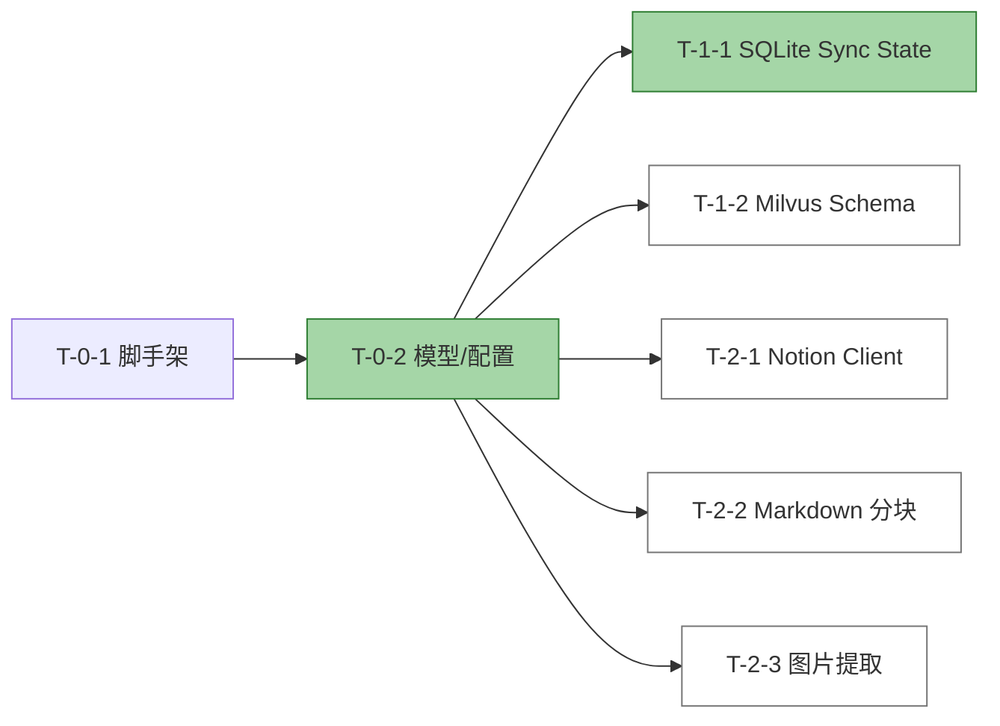

# T-1-1 Report: SQLite Sync State Store

## 任务信息

- **任务 ID**: T-1-1
- **任务名称**: SQLite Sync State Store TDD
- **前置依赖**: T-0-2
- **对应 AC**: AC-1-03
- **状态**: 完成

## 实现文件

- 实现: /Users/ray/Workspace/warehouse-profession-system/src/rag_notion_kb/storage/__init__.py
- 实现: /Users/ray/Workspace/warehouse-profession-system/src/rag_notion_kb/storage/sync_state.py
- 测试: /Users/ray/Workspace/warehouse-profession-system/tests/unit/test_sync_state.py

## TDD 循环

1. **测试设计**: 在 tests/unit/test_sync_state.py 中覆盖 upsert/get、list_all、delete、get_last_sync_time、重复更新、非法状态约束、异常包装等场景。
2. **核心实现**: 使用标准库 sqlite3 实现 SyncStateStore，包含 DDL、索引、UPSERT、事务提交与 StorageError 包装。
3. **集成验证**: 在临时文件与 :memory: 等效路径上执行 CRUD，验证 schema 与行为正确。

## 运行结果

命令: PYTHONPATH=src python3 -m unittest discover -s tests/unit -v

结果:

```text
Ran 23 tests in 0.025s
OK
```

新增 7 个测试全部通过：

| 测试用例 | 说明 |
| --- | --- |
| test_upsert_and_get | upsert 后 get 返回正确状态 |
| test_list_all | 多记录 list_all 无遗漏 |
| test_delete | delete 后记录消失 |
| test_get_last_sync_time | 返回最大 last_synced_time |
| test_upsert_updates_existing | 主键冲突时更新所有字段 |
| test_invalid_status_raises | 非法 status 触发 StorageError |
| test_database_error_wrapped | SQLite 异常被包装为领域异常 |

## 关键设计点

- 表 page_sync_state 严格对齐 Backend.md 8.1 DDL，含 2 个二级索引。
- upsert 使用 ON CONFLICT(page_id) DO UPDATE SET ... 实现页面级状态原子替换。
- model_dump() 直接映射到 SQLite 参数，避免字段错位。
- 连接关闭封装为 close()，便于测试生命周期管理。

## 任务依赖状态



## 下一步

继续执行 T-1-2: Milvus Collection Schema 与初始化 TDD。
由于沙箱无法解析 PyPI，无法通过 conda create -n rag_kb python=3.12 自动安装依赖；
当前使用系统 Python 3.14.6（已含 pymilvus 等包）继续开发。
