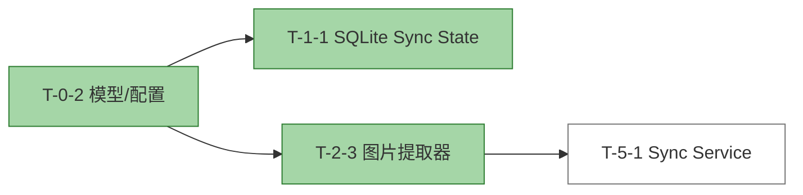

# T-2-3 Report: 图片提取器

## 任务信息

- **任务 ID**: T-2-3
- **任务名称**: 图片提取器 TDD
- **前置依赖**: T-0-2
- **对应 AC**: AC-3-01 ~ AC-3-04
- **状态**: 完成

## 实现文件

- 实现: /Users/ray/Workspace/warehouse-profession-system/src/rag_notion_kb/processing/__init__.py
- 实现: /Users/ray/Workspace/warehouse-profession-system/src/rag_notion_kb/processing/images.py
- 模型补充: /Users/ray/Workspace/warehouse-profession-system/src/rag_notion_kb/models.py（新增 PageMetadata）
- 测试: /Users/ray/Workspace/warehouse-profession-system/tests/unit/test_images.py

## TDD 循环

1. **测试设计**: 在 test_images.py 中覆盖 3 张图片提取、上下文不跨标题、无图片页面、context_text 格式、header_path/level。
2. **核心实现**: ImageExtractor 使用正则 `!\[(.*?)\]\((.*?)\)` 扫描 Markdown；同步维护标题栈；按字符窗口截取前后文，遇到上级标题停止。
3. **集成验证**: 运行单元测试，28/28 通过。

## 运行结果

```bash
PYTHONPATH=src python3 -m unittest discover -s tests/unit -v
```

结果:

```text
Ran 28 tests in 0.021s
OK
```

新增 5 个测试全部通过：

| 测试用例 | 说明 |
| --- | --- |
| test_extracts_three_images | 正确提取 3 张图片并按出现顺序排列 |
| test_context_stops_at_heading_boundary | 后文不跨越 # Section B |
| test_no_images_returns_empty | 无图片返回空列表 |
| test_context_text_format | context_text 包含图片标签与前后文 |
| test_header_path_and_level | header_path 与 header_level 跟随当前标题栈 |

## 关键设计点

- 仅依赖标准库 `re` 与 Pydantic 模型，无需外部包。
- 标题栈保证图片的 `header_path` 与 `header_level` 正确，便于后续上下文扩展。
- 上下文截取以字符窗口为准，并在遇到不高于当前层级的标题时停止。

## 任务依赖状态


