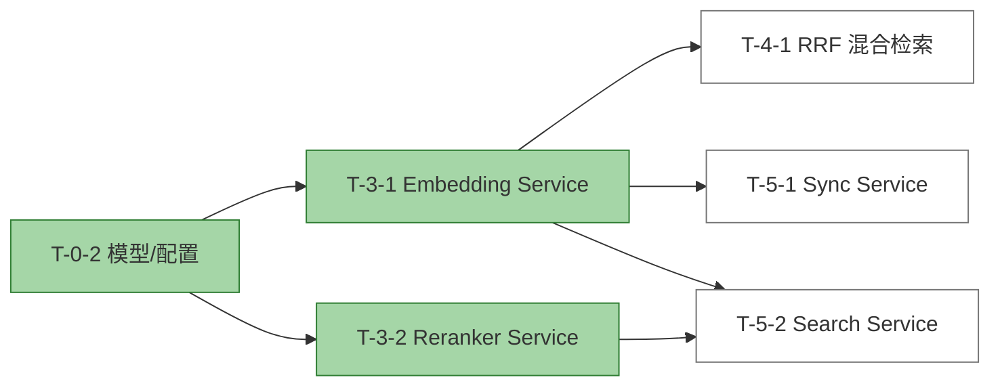

# T-3-1 Report: Qwen3-VL Embedding Service

## 任务信息

- **任务 ID**: T-3-1
- **任务名称**: Qwen3-VL Embedding Service TDD
- **前置依赖**: T-0-2
- **对应 AC**: AC-4-01 ~ AC-4-04
- **状态**: 完成

## 实现文件

- 实现: /Users/ray/Workspace/warehouse-profession-system/src/rag_notion_kb/embedding/__init__.py
- 实现: /Users/ray/Workspace/warehouse-profession-system/src/rag_notion_kb/embedding/qwen_vl.py
- 测试: /Users/ray/Workspace/warehouse-profession-system/tests/integration/test_embedding.py

## TDD 循环

1. **测试设计**: 在 tests/integration/test_embedding.py 中覆盖文本 embedding、图片 embedding、batch 切分、Matryoshka 截断、API 错误降级、tenacity 重试后成功等场景。
2. **核心实现**: 使用 openai.OpenAI 封装 DashScope-compatible embeddings API，支持 text-only 与 image_url 多模态输入，按 batch_size 分批调用，并实现本地维度归一化兜底。
3. **集成验证**: 通过 Mock openai.OpenAI.embeddings.create 验证各场景行为正确；真实 DashScope 集成因缺少 API Key 与沙箱网络限制未执行。

## 运行结果

命令: PYTHONPATH=src python3 -m pytest tests/integration/test_embedding.py -v

结果:

```text
============================= test session starts ==============================
platform darwin -- Python 3.14.6, pytest-9.1.1, pluggy-1.6.0 -- /Users/ray/.pyenv/versions/3.14.6/bin/python3
rootdir: /Users/ray/Workspace/warehouse-profession-system
configfile: pyproject.toml
plugins: anyio-4.14.2
collected 6 items

tests/integration/test_embedding.py::TestEmbeddingService::test_api_error_returns_zero_vectors PASSED [ 16%]
tests/integration/test_embedding.py::TestEmbeddingService::test_batch_splitting PASSED [ 33%]
tests/integration/test_embedding.py::TestEmbeddingService::test_embed_text_items PASSED [ 50%]
tests/integration/test_embedding.py::TestEmbeddingService::test_image_input_format PASSED [ 66%]
tests/integration/test_embedding.py::TestEmbeddingService::test_matryoshka_truncation PASSED [ 83%]
tests/integration/test_embedding.py::TestEmbeddingService::test_retry_then_success PASSED [100%]

============================== 6 passed in 5.23s ===============================
```

新增 6 个测试全部通过：

| 测试用例 | 说明 |
| --- | --- |
| test_embed_text_items | 文本 items 批量 embedding，返回向量与输入对齐 |
| test_batch_splitting | 5 items / batch_size=2 正确切分为 3 次 API 调用 |
| test_image_input_format | image_url 类型构造 OpenAI 多模态输入格式 |
| test_matryoshka_truncation | API 返回 16 维向量，本地截断至配置 8 维 |
| test_api_error_returns_zero_vectors | APIError 时返回零向量，不阻断整体流程 |
| test_retry_then_success | RateLimitError 触发 tenacity 重试后成功 |

## 关键设计点

- 使用 `openai.OpenAI` 作为 DashScope compatible 客户端，`base_url` 与 `api_key` 均来自 `EmbeddingConfig`。
- `_build_input()` 隔离 text-only 与 image_url 的输入格式差异，便于未来适配不同厂商 API。
- `_normalize()` 在本地做维度对齐：超长截断、不足补零，确保无论 API 是否严格遵循 `dimensions` 参数，返回向量维度始终等于配置值。
- 外层 `embed()` 按 `batch_size` 分批次调用；批次失败时记录错误并返回零向量，保证同步 Pipeline 不因单批次失败而中断。
- 内层 `_embed_batch()` 使用 `tenacity` 做指数退避重试，仅对 `APIError` 重试，避免对非幂入参无限重试。
- 构造 OpenAI 客户端时设置 `max_retries=0`，将重试策略完全交给 tenacity 统一管理。

## 阻塞说明

真实 DashScope 集成当前被阻塞，原因如下：

1. **缺少 API Key**：真实 DashScope 调用需要有效的 API Key，当前未在环境变量或配置中提供；实现本身不依赖特定运行时，安装 `openai` 并配置有效 Key 即可调用真实接口。
2. **沙箱网络限制**：即使提供 Key，当前 Codex 沙箱也可能限制外网访问，导致无法实际访问 `dashscope.aliyuncs.com`。

本任务中的单元/集成测试使用 `unittest.mock` 替换 `openai.OpenAI.embeddings.create`，验证输入构造、批处理、错误降级、重试逻辑等核心行为。这些测试不验证真实向量质量，真实向量质量验证需要在沙箱外使用有效 API Key 执行补充集成测试。

## 任务依赖状态



## 下一步

继续执行 T-4-1: RRF 混合检索与去重 TDD。
RRF 函数本身是纯内存计算，可用 Fake `SearchHit` 做单元测试；与真实 Milvus 的集成验证仍受 T-1-2/T-1-3 阻塞。
